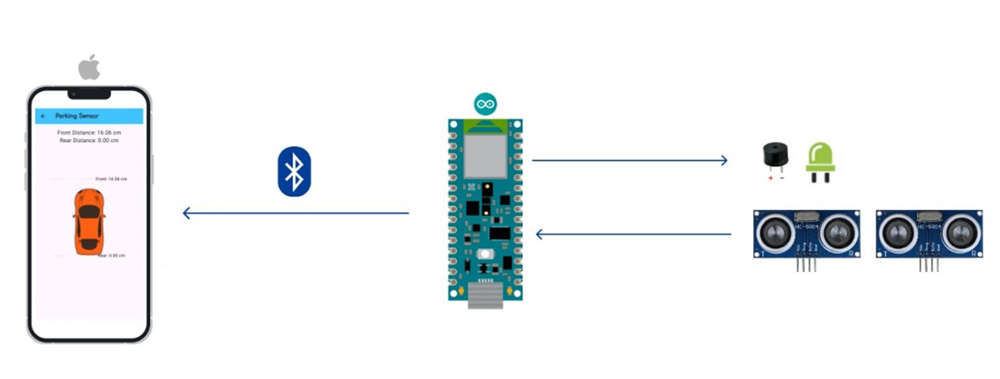
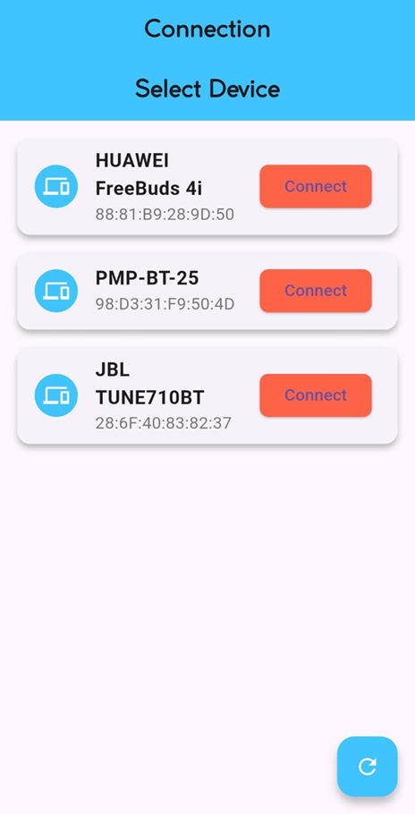
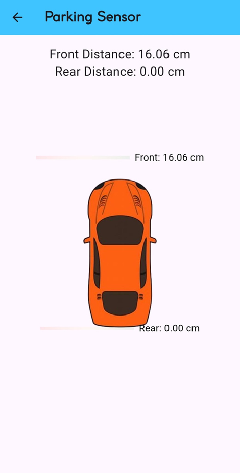

# Object Distance Detection System for Cars

This project uses an **Arduino Uno** integrated with a **Flutter application** to create a parking sensor system. The system measures the proximity of objects to the front and rear parts of a car and provides visual and auditory feedback.

---

## Features
- Detects distances using ultrasonic sensors.
- Activates an alarm (LED and buzzer) if an object is closer than 15 cm.
- Displays real-time distance measurements in a Flutter app.
- Bluetooth communication between Arduino and Flutter app.

---

## Components Used

### Hardware
- **Arduino Uno**  
- **Ultrasonic Sensors**: Measure distances to obstacles.
- **Buzzer**: Alerts the driver when the car is too close to an obstacle.  
- **LEDs**: Visual indication of the alarm state.

### Software
- **Arduino Code**: Controls sensors, actuators, and Bluetooth communication.
- **Flutter App**: Displays real-time distance measurements from the sensors.  

---

## System Diagram


---

## Arduino Code
The Arduino code controls the ultrasonic sensors, sends distance data via Bluetooth, and triggers alarms.  
```cpp
#include <SoftwareSerial.h>

#define TRIG_FRONT 2
#define ECHO_FRONT 3
#define TRIG_REAR 8 
#define ECHO_REAR 9 
#define BUZZER_PIN 4
#define LED_PIN 7

SoftwareSerial BT_SERIAL(12, 13);  
bool alarmActive = false;

void setup() {
  Serial.begin(9600);
  BT_SERIAL.begin(9600);
  pinMode(TRIG_FRONT, OUTPUT);
  pinMode(ECHO_FRONT, INPUT);
  pinMode(BUZZER_PIN, OUTPUT);
  pinMode(LED_PIN, OUTPUT);
  pinMode(TRIG_REAR, OUTPUT);
  pinMode(ECHO_REAR, INPUT);
}

void loop() {
  float frontDistance = measureDistance(TRIG_FRONT, ECHO_FRONT);
  float rearDistance = measureDistance(TRIG_REAR, ECHO_REAR);

  BT_SERIAL.print("Front:");
  BT_SERIAL.print(frontDistance);
  BT_SERIAL.print(" cm ");
  BT_SERIAL.print("Rear:");
  BT_SERIAL.print(rearDistance);
  BT_SERIAL.println(" cm");

  if (frontDistance < 15.0 || rearDistance < 15.0) {
    activateAlarm();
  } else {
    deactivateAlarm();
  }
  delay(500);
}

float measureDistance(int trigPin, int echoPin) {
  digitalWrite(trigPin, LOW);
  delayMicroseconds(2);
  digitalWrite(trigPin, HIGH);
  delayMicroseconds(10);
  digitalWrite(trigPin, LOW);
  long duration = pulseIn(echoPin, HIGH);
  return (duration * 0.034) / 2; 
}

void activateAlarm() {
  if (!alarmActive) {
    alarmActive = true;
    digitalWrite(LED_PIN, HIGH);
    tone(BUZZER_PIN, 1000);
  }
}

void deactivateAlarm() {
  if (alarmActive) {
    alarmActive = false;
    digitalWrite(LED_PIN, LOW);
    noTone(BUZZER_PIN);
  }
}
```


## Flutter Application

The Flutter app provides a user-friendly interface for real-time visualization of distance data. It connects to the Arduino via Bluetooth and displays distance measurements for the front and rear sensors.

### Key Features
- **Bluetooth Connectivity**: Automatically scans and pairs with the Arduino device.
- **Real-Time Distance Monitoring**: Displays front and rear distances in centimeters.
- **Visual Indicators**: Animated indicators represent the proximity of obstacles.
- **User-Friendly Interface**: Intuitive design for ease of use.

---


## Screenshots

### List of Bluetooth Devices


### Real-Time Distance Display


---

## How It Works

### Setup the Hardware
- Connect the ultrasonic sensors, buzzer, and LEDs to the Arduino Uno as shown in the circuit diagram.
- Refer to the schema for proper connections

### Upload the Arduino Code
- Use the Arduino IDE to upload the provided code to the Arduino Uno.

### Run the Flutter App
1. Install the Flutter app on your mobile device.
2. Pair your device with the Arduino over Bluetooth.
3. Select the Arduino from the app's device list.

### Distance Monitoring
- The app displays real-time distances from the ultrasonic sensors.
- It activates alarms (buzzer and LEDs) when an object is detected closer than 15 cm.

---

## Communication Flow
1. The ultrasonic sensors measure distances to nearby obstacles.
2. The Arduino Uno processes these measurements and sends the data via Bluetooth.
3. The Flutter app visualizes the data and triggers alerts when necessary.

---

## Future Improvements

- **Additional Sensors**: Add more ultrasonic sensors for side obstacle detection.
- **Voice Alerts**: Integrate voice-based alerts in the Flutter app for better feedback.
- **Wi-Fi Integration**: Use Wi-Fi instead of Bluetooth for improved range and reliability.
